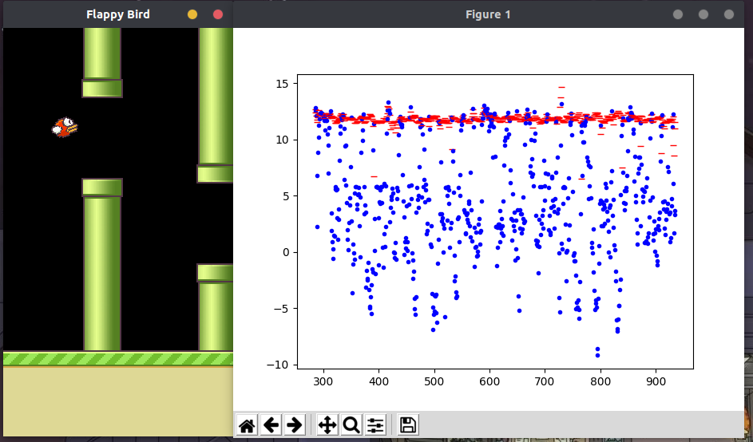

# this project trained a Deep Q NetWork to auto play flappy bird game

## overview
 <br>
the right animation shows the value of different action(flap-blue, noflap-red) on each specific frame(state). for simplicity, the background of flaypy bird game is changed to a black pic. score is no show. bird color is set to red. pip color is set to green.
## dependencies
>python==3.7.5 <br>
>numpy==1.17.4 <br>
>opencv-python==4.1.2.30 <br>
>pygame==1.9.6 <br>
>tensorflow==2.0.0 <br>

## how to play
> set up the required env <br>
> python flappy.py <br>
> when bird flapping, press h for hand mode(human), press a for ai mode(DQN). press p for animation ploting. press right or left for fps setting 
## how to trian
> comment out 
model.load_weights('./model/training_checkpoints')
model_fix.load_weights('./model/training_checkpoints') in dqn.py <br>
> python flappy.py <br>
> after a while, when there is enough replayMemory, press t for training.
## DQN algorithm
```
Initialize model and model_fix(action-value function/Deep Q Network)
while True: (each episode)
    Initialize state s_1, step=0, modelSaveStep=1000
    while episode not end:
        step += 1
        With probability ϵ select random action a_t
        otherwise select a_t=max_at  model_fix(s_t, at)
        (support human action as well if press h)
        Execute action a_t and observe r_t1, s_t1, terminate
        Store tuple (s_t,a_t,r_t1,s_t1, terminate) to replayMemery
        Sample a minibatch from replayMemery
        calculate Q-learning target:
        if terminate:
            q_target = r_t1
        else:
            q_target = r_t1 + max_a_t1 model_fix(s_t1, a_t1)
        Perform a gradient step on MSE between q_target and q_network model(s_t)
        if step % modelSaveStep == 0:
            model.save_weights
            moded_fix.load_weights
```
## reference
flapy bird game refer to  https://github.com/sourabhv/FlapPyBird <br>
DQN refer to https://github.com/yenchenlin/DeepLearningFlappyBird
